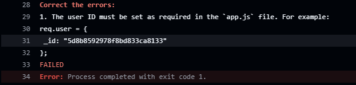

# Project 12 - Express.js for WTWR Application

In this project we were instructed to build the server-side of our What to Wear project. It introduced express.js, the use of MongoDB, Postman as well as Github Actions. With MongoDB we created databases and were able to change objects in arrays if applicable. In Postman, we are able to test our code and learn to troubleshoot errors on our own. This is similar with the use of Github Actions as well.

Throughout this project we set up a backend Api, gained more practice on route handling, and database connection. The challenging parts of this project were making sure our controllers worked properly with correct syntax and application. Working through failures in Postman helped me to develop more comprehension on express.js and understanding how routes and controllers are tasked.

[GitHub Repository] https://github.com/jonahsanpedro/se_project_express

# Project 13

This sprint focused on implementing authentication and authorization. Adding on to our Project 12 we implemented these concepts as well as other new concepts. Similartly to our last project however we had to include new controllers and routes and apply authentication and an authorization middleware. We also learned to include validation to check if users and passwords matched in a database. Finally we made us of Postman and Github Actions to test our work.

Running Github Actions led to an error but it was stated in the project that we should remove the hard-coded user object. This was leading to an errors under test_endpoints and I will include the screenshot below.

[GitHub Repository] https://github.com/jonahsanpedro/se_project_express

# WTWR (What to Wear?): Back End

The back-end project is focused on creating a server for the WTWR application. You’ll gain a deeper understanding of how to work with databases, set up security and testing, and deploy web applications on a remote machine. The eventual goal is to create a server with an API and user authorization.

## Running the Project

`npm run start` — to launch the server

`npm run dev` — to launch the server with the hot reload feature

# Project 15

This sprint introduced cloud deployment and expanded out knowledge on advanced middleware. We also were introduced to request validation in separate middlewares using joi, celebrate and validator while logging requets and errors with winston. This project was different from the others in the past as I deployed my first website on the web.

[Domain - Fontend] https://vheissu.jumpingcrab.com/
[Domain - Backend] https://api.vheissu.jumpingcrab.com/
